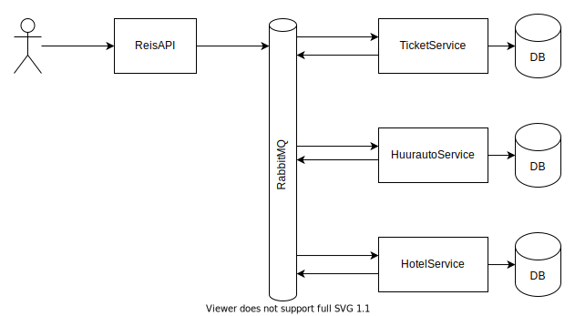

# Saga Reisbureau

Een project om het gebruik van een choreography-based saga te demonstreren.



## Uitvoeren

Je kan het project uitvoeren door deze commando's in de rootmap uit te voeren:

```bash
docker-compose up --build -d
docker-compose logs -f ticketservice huurautoservice hotelservice reisapi
```

De API wordt standaard exposed op poort `8080`. De `mongo-express` web interface voor de TicketService database draait standaard op poort `8081`.

Om een transactie te starten moet er een POST-request verstuurd worden naar `/reizen`. Bijvoorbeeld:

```bash
curl -X POST http://localhost:8080/reizen
```